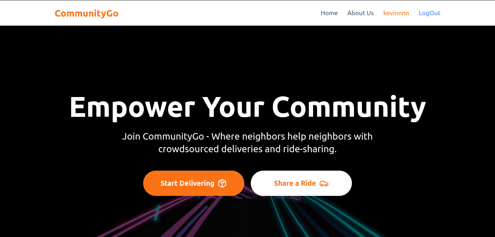
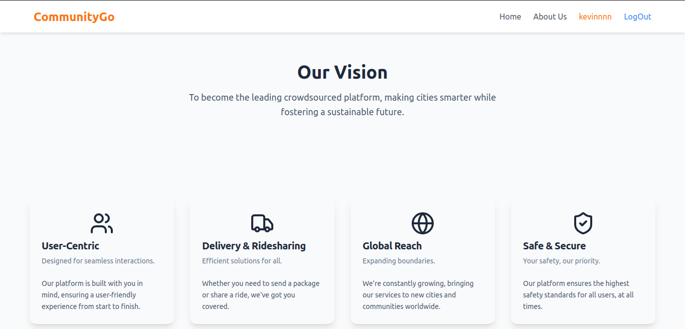
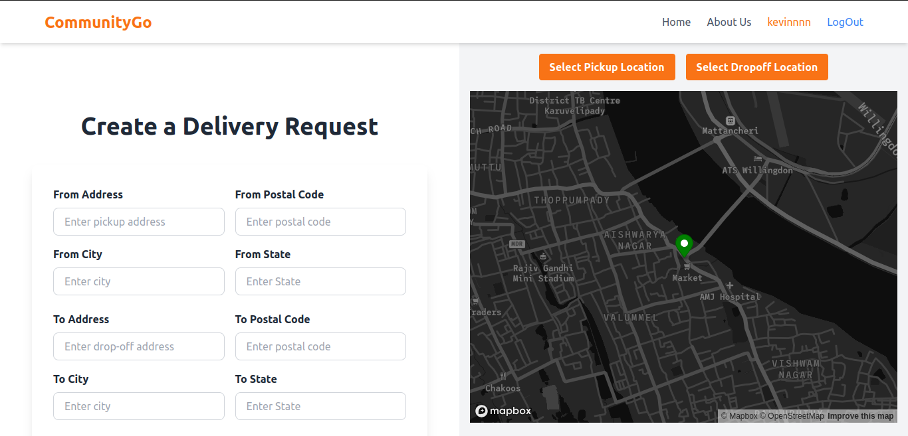
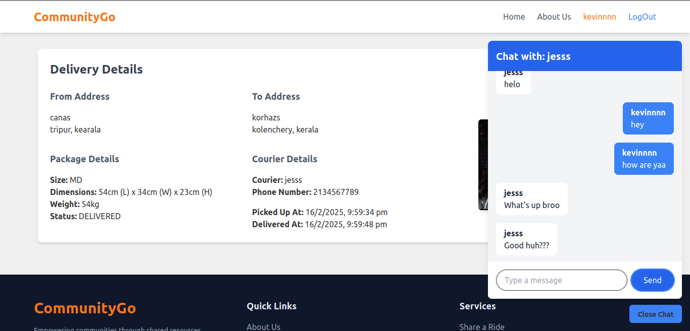
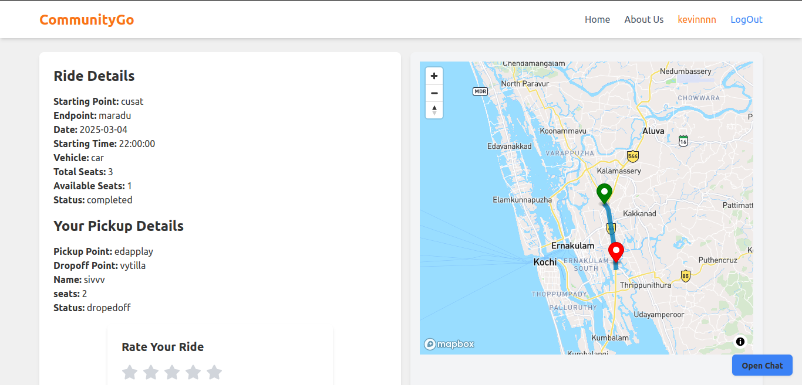

# CommunityGo

CommunityGo is a smart, crowdsourced delivery and ride-sharing platform designed to help people make the most of their daily travel. If you're already heading to a destination, why not earn on the way? With CommunityGo, drivers can pick up delivery requests or share rides with others traveling in the same direction — turning regular commutes into earning opportunities.

Whether it’s delivering a package or offering a lift, CommunityGo connects users and drivers through a secure, real-time platform. Built with Django on the backend and React + Redux on the frontend, it ensures smooth interactions, efficient task management, and real-time updates.

<br><br><br>
## 💰 Earn while you travel



## Our Vision...


## Features

### User Side
- JWT authentication for secure login.
- User registration and profile management.
- Request a ride or delivery service.
- Track ride or delivery in real-time.
- Payment integration for seamless transactions.
- Ratings and reviews for drivers and customers.

<br>

### 💸 Need a package delivered? Request it for a low cost.



<br>

### 📦 Deliver packages and earn while heading to your destination.



### Driver Side
- Register as a driver and manage availability.
- Accept or decline ride/delivery requests.
- Real-time navigation and tracking.
- Earnings dashboard with payment history.

<br>

### 🚙 Share your ride and make money without extra effort.



### Admin Side
- Admin login with role-based access control.
- Dashboard with user and driver management options.
- View, search, create, edit, and delete users and drivers.
- Monitor rides and deliveries in progress.
- Handle disputes and customer support queries.

## Tech Stack
- **Frontend**: React, Redux, React Router
- **Backend**: Django, Django Rest Framework (DRF)
- **Database**: PostgreSQL
- **Authentication**: JWT (JSON Web Token)
- **Real-Time Features**: WebSockets for live tracking

## Installation

### Prerequisites
Ensure you have the following installed on your system:
- Python (3.x)
- Node.js & npm
- PostgreSQL

### Backend Setup
1. Clone the repository:
   ```bash
   git clone https://github.com/yourusername/CommunityGo.git
   cd CommunityGo/backend
   ```
2. Create a virtual environment:
   ```bash
   python -m venv venv
   source venv/bin/activate  # On Windows use: venv\Scripts\activate
   ```
3. Install dependencies:
   ```bash
   pip install -r requirements.txt
   ```
4. Configure the database in `settings.py`.
5. Run migrations:
   ```bash
   python manage.py migrate
   ```
6. Create a superuser:
   ```bash
   python manage.py createsuperuser
   ```
7. Start the Django server:
   ```bash
   python manage.py runserver
   ```

### Frontend Setup
1. Navigate to the frontend directory:
   ```bash
   cd ../frontend
   ```
2. Install dependencies:
   ```bash
   npm install
   ```
3. Start the React app:
   ```bash
   npm start
   ```

## Contributing
Contributions are welcome! Feel free to open issues and submit pull requests.

## License
This project is licensed under the MIT License.

## Contact
For any inquiries or contributions, reach out via donjorois@gmail.com .

